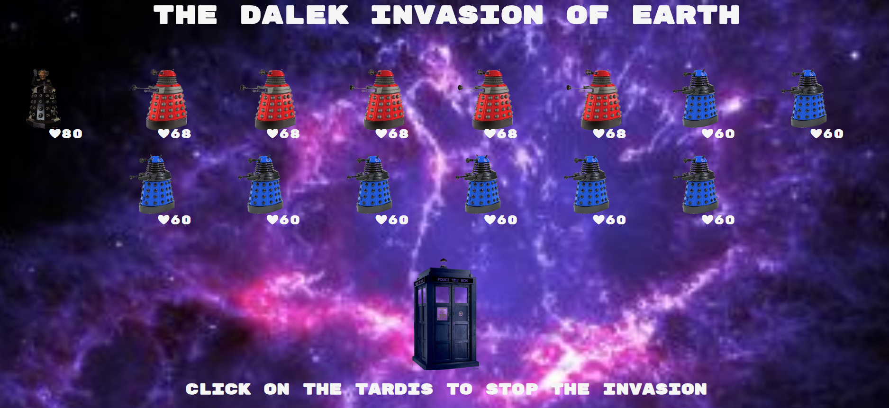

# alien-mothership-game
A game created using Vanilla JavaScript, HTML and CSS.

I created this game using object-oriented programming. I learned how to handle event listeners, and understand classes and inheritance as well as the DOM model. 

## Installation

Clone down the repo and run yarn install.

## Next steps
At the moment the code is functional, however aim of the next refractoring will be to make code drier.
It will include looping over the array of alien ships and creatng html elements displaying hitPoints direcly from that loop (making showHitPoint() a loop). 

## Screenshot

